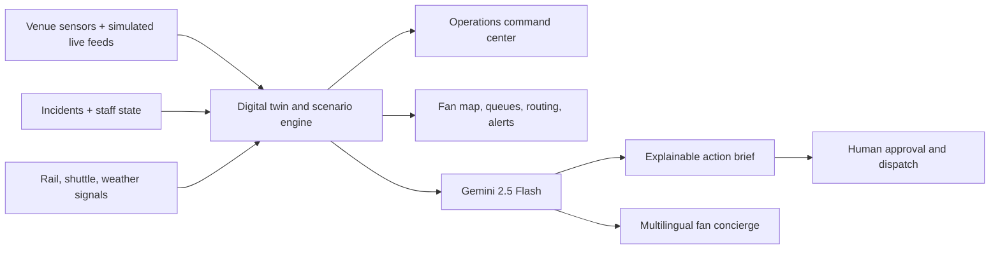

# StadiumIQ NEXUS

### GenAI tournament intelligence for the FIFA World Cup 2026

StadiumIQ NEXUS is a two-sided smart-stadium platform for **Prompt Wars Challenge 4: Smart Stadiums & Tournament Operations**. It connects a live venue command center with a multilingual, accessible fan companion so organizers and guests act from the same operational picture.

The prototype simulates a World Cup 2026 matchday at New York New Jersey Stadium using synthetic data. It works without credentials for reliable judging and upgrades to Gemini-powered recommendations when a key is configured.

## The problem

Tournament operations are fragmented across crowd sensors, transport teams, accessibility staff, venue control rooms, volunteers, and fan-facing channels. A raw dashboard can show what is happening, but it does not reliably answer the harder question: **what should each team do next without creating a new bottleneck somewhere else?**

## The solution

NEXUS creates one shared, explainable intelligence layer:

- **Venue digital twin:** converts live crowd signals into sector-level risk, 15-minute forecasts, and recommended interventions.
- **Scenario intelligence:** models steady state, ingress surge, halftime rush, severe weather, and full-time egress.
- **Gemini operations copilot:** turns the current scenario, sector telemetry, and incident queue into three concise, human-approved actions.
- **Incident orchestration:** lets operators assign response tickets while keeping ownership and status visible.
- **Accessible wayfinding:** protects step-free lanes and routes fans around congestion.
- **Multilingual fan AI:** answers navigation, service, safety, and matchday questions with venue context.
- **Transport coordination:** exposes rail and shuttle load so gate releases can be synchronized with external capacity.
- **Sustainability signals:** estimates impact from public-transport nudges and keeps low-waste interventions visible.

## Why it is GenAI-enabled, not just AI-themed

The command copilot receives structured live context—scenario, crowd density, risk, trends, accessibility state, gates, and incidents—and generates a short operational brief. The fan assistant uses a separate safety-aware system prompt for multilingual service and navigation questions.

Both surfaces use **Gemini 2.5 Flash** by default. Every Gemini call has a deterministic local fallback, so the demo remains functional without a key or network access. AI recommendations are never presented as already dispatched; operators must approve or assign actions.

## Product surfaces

| Surface | Primary user | Purpose |
| --- | --- | --- |
| `/` | Venue command, organizers | Digital twin, scenarios, risk, incidents, transport, accessibility, sustainability, Gemini brief |
| `/map` | Fans and venue staff | Live crowd heatmap and venue points of interest |
| `/queues` | Fans and concessions | Current and predicted queue demand |
| `/navigate` | Fans, accessibility teams | Crowd-aware and step-free routing |
| `/chat` | International fans | Multilingual Gemini concierge and visual location help |
| `/feed` | All attendees | Match, safety, operations, and service updates |

## Demo flow

1. Open the NEXUS command center and point out that the same simulator feeds every surface.
2. Switch from **Steady** to **Halftime** and show Food Hall risk and the 15-minute forecast update.
3. Select a sector on the digital twin to inspect density, trend, gate, and recommended intervention.
4. Generate a fresh AI mission brief and approve one of the proposed actions.
5. Assign the open queue-spillover incident and show ownership change immediately.
6. Switch to **Weather** to demonstrate calm shelter guidance and accessibility protection.
7. Open **Fan experience** and show crowd-aware routing, queues, and the multilingual Stadium Buddy.

## Architecture



Core implementation:

- `src/lib/operations.ts`: typed scenarios, sectors, risk engine, forecasts, readiness metrics, and deterministic GenAI fallback.
- `src/app/api/operations/route.ts`: secure Gemini-backed operations briefing endpoint.
- `src/app/page.tsx`: interactive Challenge 4 command experience.
- `src/components/AppProvider.tsx`: shared live crowd, queue, game, accessibility, and theme state.
- `src/lib/venue-data.ts`: synthetic World Cup 2026 venue data and fan-assistant context.

## Run locally

```powershell
npm install
Copy-Item .env.example .env.local
npm run dev
```

The app works without editing `.env.local`. To enable live Gemini generation:

```env
GEMINI_API_KEY=your-key
GEMINI_MODEL=gemini-2.5-flash
```

## Validate

```powershell
npm run lint
npm test -- --runInBand
npm run build
```

The suite covers API validation, security headers, simulation logic, operations risk, Gemini fallbacks, venue integrity, Firebase behavior, Maps helpers, and utility functions.

## Responsible deployment assumptions

- All fans, incidents, locations, teams, and operational signals are synthetic demo data.
- The prototype does not claim access to FIFA, venue, law-enforcement, medical, or transport systems.
- GenAI provides decision support; staff remain accountable for approval and dispatch.
- Emergency guidance directs guests to venue staff and official signage.
- A production rollout would require authenticated roles, audit logs, privacy review, sensor contracts, service-level monitoring, and venue-specific emergency procedures.

See [docs/CHALLENGE_4_SUBMISSION.md](docs/CHALLENGE_4_SUBMISSION.md) for the submission-ready concept, judging story, and 90-second pitch.
