<div align="center">
  <h1>🏟️ StadiumIQ</h1>
  <p><strong>Your AI-Powered Personal Stadium Concierge</strong></p>
  <p><em>Built for the Google PromptWars Hackathon 2026</em></p>

  <p>
    <a href="#-the-problem"></a>
    <a href="#-architecture"></a>
    <a href="#-evaluation-criteria"></a>
    <a href="#-tech-stack"></a>
    <a href="#-testing"></a>
  </p>
</div>

---

## 🎯 Chosen Vertical

**Physical Event Experience** — Building a smart, dynamic AI assistant for live sporting venue management that helps fans navigate, find services, and avoid crowds in real-time.

---

## 🛑 The Problem

Large-scale physical events and sporting venues struggle with **crowd bottlenecks**, **long queue times**, and **disorientation**. Fans often miss critical moments of the game while blindly searching for the shortest restroom line or wandering huge corridors looking for their seat or food.

## 💡 Approach & Logic

Our approach combines five core strategies:

1. **Context-Aware AI**: Gemini 2.0 Flash is injected with live venue state (crowd density, queue times, game score, POI data) via a structured system prompt — making every AI response spatially and temporally aware.
2. **Real-Time Simulation Engine**: A deterministic crowd simulator generates realistic density fluctuations, queue changes, and game progression, enabling live demo without backend infrastructure.
3. **Predictive Intelligence**: By analyzing crowd trends (increasing/decreasing/stable), the system proactively warns users before congestion peaks — e.g., alerting fans to eat before halftime.
4. **Graceful Degradation**: Every external service (Gemini, Firebase, Maps, TTS, Places) has a local fallback, ensuring 100% uptime even without API keys.
5. **Multi-Modal AI**: Text chat + image-based location detection (Gemini Vision) + AI crowd insights + multi-language translation + safety briefings provide **five** distinct AI/ML touchpoints.

## 🚀 Our Solution: StadiumIQ

**StadiumIQ** solves venue friction by putting an omniscient, AI-powered stadium concierge in every attendee's pocket. It eliminates guesswork by providing real-time crowd heatmaps, smart navigation, and predictive queue AI. 

<details>
<summary><strong>✨ Click to view key features</strong></summary>

- **🤖 Stadium Buddy (Gemini AI)**: A chatbot that knows exactly what's happening. Ask it, *"Where is the closest restroom?"* and it analyzes 22 live queues to give you the fastest option.
- **👁️ "Where Am I?" (Gemini Vision)**: Lost? Snap a photo of your surroundings, and Gemini Vision analyzes it against the stadium model to tell you where you are and how to navigate.
- **🗺️ Live Heatmaps (Maps JS API)**: Custom vector map overlays showing current crowd density in 8 different venue zones, updating every 5 seconds.
- **⏱️ Predictive Queues**: Simulated real-time queue synchronization that warns fans *before* the rush hits (e.g., *"Halftime in 10 mins. Food lines will 3x. Go now!"*).
- **🔮 AI Crowd Insights (Gemini)**: AI-powered natural-language crowd analysis that summarizes venue conditions and provides actionable intelligence beyond raw data.
- **🌐 Multi-Language Support (Gemini Translation)**: Gemini-powered real-time translation for international visitors — supports Hindi, Spanish, and more.
- **🛡️ AI Safety Briefings (Gemini)**: Personalized safety briefings based on the fan's seat section — nearest exits, first aid, and safety tips.
- **🔊 Accessible Audio Alerts (Cloud TTS)**: Google Cloud Text-to-Speech integration reads crowd alerts and navigation steps aloud for visually impaired attendees.
- **📍 Venue Geocoding (Geocoding API)**: Reverse geocoding converts venue coordinates to structured addresses for enhanced POI descriptions.
- **🏪 Nearby Places (Places API)**: Google Places API integration helps fans find nearby transit stations, parking, restaurants, and hospitals.
- **📊 Firebase Analytics Pipeline**: Structured event tracking and crowd snapshot persistence via Firestore for historical analysis and trend prediction.
- **♿ Accessible Navigation**: Smart wayfinding algorithm that actively calculates paths **around** dense crowds, or strictly routes via elevators/ramps for accessibility.
</details>

---

## 🧠 System Architecture

```mermaid
graph TD
    Client[📱 Client App<br/>Next.js Server Components]
    
    subgraph Google Services
        Gemini[🧠 Gemini 2.0 Flash<br/>Text, Vision, Translation & Safety]
        Maps[🗺️ Google Maps Platform<br/>Maps JS, Geocoding & Places APIs]
        TTS[🔊 Cloud Text-to-Speech<br/>Accessible Audio Alerts]
        Firebase[🔥 Firebase<br/>Auth, Firestore & Analytics]
    end

    subgraph Backend Logic
        API[⚡ Next.js API Routes<br/>Chat, TTS, Geocode, Places, Analytics]
        Sim[⚙️ Crowd & Queue Simulator Engine]
        Validators[🛡️ Input Validators & Sanitizers]
    end

    Client <-->|Live Updates| Sim
    Client <-->|Interacts| Maps
    Client <-->|Chat & Images| API
    
    API <-->|Context & Prompts| Gemini
    API <-->|Speech Synthesis| TTS
    API <-->|Auth & DB| Firebase
    Validators -.->|Validates| API
    
    Sim -.->|Feeds data to| Client
```



---

## 📂 Project Structure

```text
stadium-iq/
├── public/                 # Static assets (icons, manifests)
├── src/
│   ├── __tests__/          # Comprehensive test suites (301 tests)
│   │   ├── api/            # API route integration tests (4 routes)
│   │   ├── lib/            # Core library unit tests (8 modules)
│   │   └── utils/          # Utility function tests
│   ├── app/                # Next.js 14 App Router
│   │   ├── api/            # Serverless backend routes
│   │   │   ├── analytics/  # Firebase analytics pipeline
│   │   │   ├── chat/       # Gemini AI endpoint handler
│   │   │   ├── geocode/    # Google Geocoding API handler
│   │   │   ├── places/     # Google Places API handler
│   │   │   └── tts/        # Google Cloud TTS handler
│   │   ├── chat/           # Chatbot UI & logic
│   │   ├── feed/           # Gamified events & live feed
│   │   ├── map/            # Google Maps heatmap interface
│   │   ├── navigate/       # Smart wayfinding UI
│   │   ├── queues/         # Wait time dashboard
│   │   ├── globals.css     # Bespoke Design System & Tokens
│   │   ├── layout.tsx      # Root provider & standard layout
│   │   └── page.tsx        # Homepage dashboard
│   ├── components/         # Reusable atomic UI elements
│   │   ├── ErrorBoundary.tsx   # Graceful error handling
│   │   ├── AppProvider.tsx     # Global state & theme provider
│   │   └── layout/            # Navigation components
│   ├── lib/                # Core service integrations
│   │   ├── analytics.ts    # Firebase event tracking & page views
│   │   ├── constants.ts    # Centralized configuration constants
│   │   ├── crowd-simulator.ts  # Generates realistic live crowd fluctuations
│   │   ├── firebase.ts     # Firebase client + Firestore persistence
│   │   ├── gemini.ts       # Gemini API client, prompts, translation & safety
│   │   ├── google-cloud.ts # Cloud TTS, Geocoding & Places APIs
│   │   ├── validators.ts   # Input validation & sanitization
│   │   └── venue-data.ts   # Core venue Graph (Nodes & POIs)
│   ├── types/              # Strict TypeScript interfaces
│   └── utils/              # Calculation helpers (Haversine, etc.)
├── jest.config.ts          # Test configuration
└── package.json            # Dependencies
```

---

## 🏆 Meeting the Hackathon Evaluation Criteria

### 1. Meaningful Google Services Integration (10 Services)
We didn't just drop an iframe of a map. We deeply integrated **ten** core Google tools:

| # | Service | Module | Purpose |
|---|---------|--------|---------|
| 1 | **Gemini API (Text)** | `lib/gemini.ts` | Stadium Buddy chatbot with injected live venue state |
| 2 | **Gemini API (Vision)** | `lib/gemini.ts` | "Where Am I?" photo-based location detection |
| 3 | **Gemini API (Translation)** | `lib/gemini.ts` | `translateMessage()` for multi-language fan support |
| 4 | **Gemini API (Safety)** | `lib/gemini.ts` | `generateSafetyBriefing()` for personalized exit/first-aid info |
| 5 | **Gemini API (Insights)** | `lib/gemini.ts` | `generateCrowdInsight()` for NL crowd analysis |
| 6 | **Google Maps JS API** | `app/map/` | Live zone-based spatial heat grid over the venue |
| 7 | **Geocoding API** | `lib/google-cloud.ts` | `reverseGeocode()` for structured venue addresses |
| 8 | **Places API** | `lib/google-cloud.ts` | `searchNearbyPlaces()` for transit, parking, hospitals |
| 9 | **Cloud Text-to-Speech** | `lib/google-cloud.ts` | `synthesizeSpeech()` for accessible audio alerts |
| 10 | **Firebase (Auth + Firestore + Analytics)** | `lib/firebase.ts`, `lib/analytics.ts` | Anonymous auth, crowd persistence, event tracking |

### 2. Code Quality & Clean Architecture
- **Strictly Typed**: Built top-to-bottom in TypeScript ensuring stable component props and predictive API responses (`/src/types/index.ts`).
- **Centralized Constants**: All magic numbers and configuration values extracted to `lib/constants.ts` — no hardcoded values scattered across the codebase.
- **Input Validation**: Dedicated `lib/validators.ts` module with validation for chat messages, analytics events, coordinates, image data, and XSS sanitization.
- **Security Headers**: All API routes include `X-Content-Type-Options`, `X-Frame-Options`, and `Cache-Control` headers.
- **JSDoc Documentation**: Every exported function across `lib/`, `utils/`, and API routes has comprehensive JSDoc documentation with examples.
- **Error Boundaries**: Application-level `ErrorBoundary` component ensures graceful failure handling — fans never see a blank screen.
- **Separation of Concerns**: Extracted simulation engines (`crowd-simulator`), SDK inits (`lib/xyz`), validators, constants, and UI components (`app/xyz`) into isolated modules.
- **No Reliance on CSS Frameworks**: Avoided Tailwind block-bloat by utilizing clean, scoped Vanilla CSS Modules with a custom `--css-var` tokenized design system.

### 3. Efficiency & Optimal Resource Use
- Relies heavily on **Server-Side API Routes** to obscure API keys, format requests securely, and handle the heavy lifting.
- Components are heavily memoized using React's `useMemo` hooks (e.g., sorting the Queue table instantly on the client side without refetching data).
- Custom debounce hooks handle map zooms to prevent over-pinging map tile APIs.
- Firebase batch writes in the analytics pipeline minimize network overhead.
- Analytics batch validation prevents oversized payloads via `MAX_ANALYTICS_BATCH_SIZE`.

### 4. Testing Strategy
- **301 automated tests** across **14 test suites** covering:
  - **Constants validation** (25 tests): All thresholds, limits, and configuration values validated for correct ranges
  - **Input validators** (30 tests): Chat messages, analytics events, coordinates, image data, and XSS sanitization
  - **Google Cloud services** (25 tests): TTS synthesis, geocoding, and Places API fallback behavior
  - **Utility functions** (9 functions, 100% coverage): Distance calculations, formatting, density levels
  - **Simulation engine** (4 functions): Crowd updates, queue changes, game progression, predictions
  - **Venue data integrity** (25+ assertions): POI uniqueness, valid categories, correct data bounds
  - **Gemini AI client** (25 tests): Fallback responses, safety briefings, translation, all keyword categories
  - **Firebase client** (14 tests): Singleton behavior, graceful auth, crowd writes, history reads
  - **Chat API route** (9 tests): Validation, security headers, text/vision handling, history support
  - **Analytics API route** (12 tests): Batch validation, event schema, security headers, GET summary
  - **TTS API route** (8 tests): Text validation, language codes, gender, speaking rate
  - **Geocode API route** (7 tests): Coordinate validation, address components, GET endpoint
  - **Places API route** (9 tests): Type validation, radius clamping, transit/parking results
- Test command: `npm test` (with coverage report)

### 5. Accessibility (A11y) Focus
- The `AppProvider` includes dedicated **Screen Reader**, **Reduced Motion**, and **High Contrast** state toggles.
- **Cloud Text-to-Speech**: Crowd alerts and navigation steps can be read aloud for visually impaired attendees.
- Deep focus on **Accessible Wayfinding**: The navigation algorithm dynamically flags and drops staircases from nodes when `accessibleRoute = true`.
- Forms utilize HTML native ARIA labels for seamless e-reader navigation.
- Skip-to-content link and semantic `role` attributes on all major sections.

### 6. Security & Safety
- **Safe Keys**: All API keys are stored server-side via Next.js `/api/` proxy routes (`.env.local`), ensuring `process.env` secrets never leak into client bundles.
- **Input Validation**: Dedicated `validators.ts` module validates all user inputs — message length, event types, coordinate ranges, image sizes, and XSS sanitization.
- **Security Headers**: All API responses include `X-Content-Type-Options: nosniff`, `X-Frame-Options: DENY`, and `Cache-Control: no-store`.
- **Error Boundaries**: Application-level error catching prevents crash exposure.
- **Fallback Simulation**: If API limits are hit during demos, the system gracefully falls back to a deterministic local engine rather than crashing, ensuring 100% demo uptime.

---

## 🧪 Testing

StadiumIQ has a comprehensive automated test suite built with **Jest** and designed for CI/CD pipelines.

```bash
# Run all tests with coverage report
npm test

# Watch mode for development
npm run test:watch

# CI mode with machine-readable output
npm run test:ci
```

**Test Coverage Summary:**

| Module | Statements | Branches | Functions | Lines |
|---|---|---|---|---|
| `utils/helpers.ts` | 100% | 100% | 100% | 100% |
| `lib/constants.ts` | 100% | 100% | 100% | 100% |
| `lib/validators.ts` | 100% | 100% | 100% | 100% |
| `lib/venue-data.ts` | 100% | 100% | 100% | 100% |
| `lib/firebase.ts` | 90% | 95% | 100% | 90% |
| `lib/analytics.ts` | 82% | 50% | 100% | 81% |
| `lib/crowd-simulator.ts` | 85% | 79% | 100% | 88% |
| `app/api/chat/route.ts` | 90% | 95% | 100% | 90% |
| `app/api/places/route.ts` | 92% | 100% | 100% | 92% |
| `app/api/geocode/route.ts` | 88% | 100% | 100% | 88% |
| `app/api/tts/route.ts` | 88% | 100% | 100% | 88% |
| `app/api/analytics/route.ts` | 63% | 77% | 100% | 63% |
| `lib/gemini.ts` | 65% | 82% | 93% | 64% |
| `lib/google-cloud.ts` | 25% | 10% | 75% | 27% |

---

## 💻 Tech Stack

- **Framework**: [Next.js 14](https://nextjs.org/) (App Router format for fast SSR)
- **Language**: [TypeScript](https://www.typescriptlang.org/)
- **AI Tools**: [@google/generative-ai](https://www.npmjs.com/package/@google/generative-ai) (Gemini 2.0 Flash — Text, Vision, Translation, Safety & Insights)
- **Mapping**: [@googlemaps/js-api-loader](https://www.npmjs.com/package/@googlemaps/js-api-loader) (Maps, Geocoding, Places)
- **Accessibility**: Google Cloud Text-to-Speech API
- **Realtime / Auth / Analytics**: [Firebase](https://firebase.google.com/) (Firestore, Auth, Analytics pipeline)
- **Testing**: [Jest](https://jestjs.io/) + [ts-jest](https://kulshekhar.github.io/ts-jest/) — 301 tests, 14 suites
- **Deployment**: [Vercel](https://vercel.com)

---

## 🛠️ Quick Start

**1. Clone the repository**
```bash
git clone https://github.com/AnuranjanJain/promptwars-stadium-iq.git
cd promptwars-stadium-iq
```

**2. Install dependencies**
```bash
npm install
```

**3. Configure Environment**
Copy `.env.example` to `.env.local` and add your **Gemini API Key**:
```env
GEMINI_API_KEY=your_gemini_key_here
```
*(Note: If no API key is provided, the application will cleverly use a fallback offline engine so it is always presentable!)*

**4. Run Tests**
```bash
npm test
```

**5. Start the Application**
```bash
npm run dev
```

Browse to `http://localhost:3000` and enjoy the smart venue experience!

---

## 📝 Assumptions Made

1. **Simulated Environment**: Since we don't have a real stadium deployment, crowd density, queue times, and game state are generated by a deterministic simulation engine that mimics realistic patterns.
2. **Offline-First**: The application is designed to work fully without API keys by using intelligent fallback responses — this ensures judges can evaluate the complete experience without configuring credentials.
3. **Single Venue**: The solution is architected around a single venue (National Arena, 60,000 seats) but the modular design allows easy extension to multiple venues.
4. **Mobile-First**: The UI is optimized for mobile-first usage (fans at a stadium) with responsive desktop support.
5. **Anonymous Users**: Firebase Anonymous Auth is used for frictionless user identification — no sign-up required to use the app.
6. **Demo Data**: Menu prices, team names, and trivia questions use fictional but realistic data to demonstrate the full feature set.
