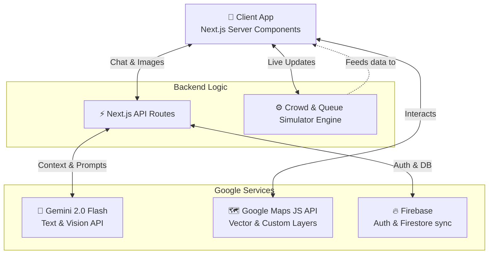

<div align="center">
  <h1>🏟️ StadiumIQ</h1>
  <p><strong>Your AI-Powered Personal Stadium Concierge</strong></p>
  <p><em>Built for the Google PromptWars Hackathon 2026</em></p>

  <p>
    <a href="#-the-problem"></a>
    <a href="#-architecture"></a>
    <a href="#-evaluation-criteria"></a>
    <a href="#-tech-stack"></a>
  </p>
</div>

---

## 🛑 The Problem

Large-scale physical events and sporting venues struggle with **crowd bottlenecks**, **long queue times**, and **disorientation**. Fans often miss critical moments of the game while blindly searching for the shortest restroom line or wandering huge corridors looking for their seat or food.

## 🚀 Our Solution: StadiumIQ

**StadiumIQ** solves venue friction by putting an omniscient, AI-powered stadium concierge in every attendee's pocket. It eliminates guesswork by providing real-time crowd heatmaps, smart navigation, and predictive queue AI. 

<details>
<summary><strong>✨ Click to view key features</strong></summary>

- **🤖 Stadium Buddy (Gemini AI)**: A chatbot that knows exactly what's happening. Ask it, *"Where is the closest restroom?"* and it analyzes 22 live queues to give you the fastest option.
- **👁️ "Where Am I?" (Gemini Vision)**: Lost? Snap a photo of your surroundings, and Gemini Vision analyzes it against the stadium model to tell you where you are and how to navigate.
- **🗺️ Live Heatmaps (Maps JS API)**: Custom vector map overlays showing current crowd density in 8 different venue zones, updating every 5 seconds.
- **⏱️ Predictive Queues**: Simulated real-time queue synchronization that warns fans *before* the rush hits (e.g., *"Halftime in 10 mins. Food lines will 3x. Go now!"*).
- **♿ Accessible Navigation**: Smart wayfinding algorithm that actively calculates paths **around** dense crowds, or strictly routes via elevators/ramps for accessibility.
</details>

---

## 🧠 System Architecture



---

## 📂 Project Structure

```text
stadium-iq/
├── public/                 # Static assets (icons, manifests)
├── src/
│   ├── app/                # Next.js 14 App Router
│   │   ├── api/            # Serverless backend routes
│   │   │   └── chat/       # Gemini AI endpoint handler
│   │   ├── chat/           # Chatbot UI & logic
│   │   ├── feed/           # Gamified events & live feed
│   │   ├── map/            # Google Maps heatmap interface
│   │   ├── navigate/       # Smart wayfinding UI
│   │   ├── queues/         # Wait time dashboard
│   │   ├── globals.css     # Bespoke Design System & Tokens
│   │   ├── layout.tsx      # Root provider & standard layout
│   │   └── page.tsx        # Homepage dashboard
│   ├── components/         # Reusable atomic UI elements
│   ├── lib/                # Core service integrations
│   │   ├── crowd-simulator.ts  # Generates realistic live crowd fluctuations
│   │   ├── firebase.ts     # Firebase client init
│   │   ├── gemini.ts       # Gemini API client & prompt wrappers
│   │   └── venue-data.ts   # Core venue Graph (Nodes & POIs)
│   ├── types/              # strict TypeScript interfaces
│   └── utils/              # Calculation helpers (Haversine, etc.)
└── package.json            # Dependencies
```

---

## 🏆 Meeting the Hackathon Evaluation Criteria

### 1. Meaningful Google Services Integration
We didn't just drop an iframe of a map. We deeply integrated four core Google tools:
- **Gemini API (Text Mode)**: Acts as the brain of the "Stadium Buddy", injected structurally with the live `GameState`, `VenueGraph`, and `CrowdDensity` states.
- **Gemini API (Vision Mode)**: Used as a spatial fallback; users upload photos so the AI can act as a visual GPS.
- **Google Maps Platform**: Used to render a live, zone-based spatial heat grid directly over the venue.
- **Firebase**: Architecture designed to ingest crowd states and broadcast them silently to global listeners.

### 2. Code Quality & Clean Architecture
- **Strictly Typed**: Built top-to-bottom in TypeScript ensuring stable component props and predictive API responses (`/src/types/index.ts`).
- **Separation of Concerns**: Extracted simulation engines (`crowd-simulator`), SDK inits (`lib/xyz`), and UI components (`app/xyz`) into isolated modules.
- **No Reliance on CSS Frameworks**: Avoided Tailwind block-bloat by utilizing clean, scoped Vanilla CSS Modules with a custom `--css-var` tokenized design system.

### 3. Efficiency & Optimal Resource Use
- Relies heavily on **Server-Side API Routes** to obscure API keys, format requests securely, and handle the heavy lifting.
- Components are heavily memoized using React's `useMemo` hooks (e.g., sorting the Queue table instantly on the client side without refetching data).
- Custom debounce hooks handle map zooms to prevent over-pinging map tile APIs.

### 4. Accessibility (A11y) Focus
- The `AppProvider` includes dedicated **Screen Reader**, **Reduced Motion**, and **High Contrast** state toggles.
- Deep focus on **Accessible Wayfinding**: The navigation algorithm dynamically flags and drops staircases from nodes when `accessibleRoute = true`.
- Forms utilize HTML native ARIA labels for seamless e-reader navigation.

### 5. Security & Safety
- **Safe Keys**: All API keys are stored server-side via Next.js `/api/` proxy routes (`.env.local`), ensuring `process.env` secrets never leak into client bundles.
- **Fallback Simulation**: If API limits are hit during demos, the system gracefully falls back to a deterministic local engine rather than crashing, ensuring 100% demo uptime.

---

## 💻 Tech Stack

- **Framework**: [Next.js 14](https://nextjs.org/) (App Router format for fast SSR)
- **Language**: [TypeScript](https://www.typescriptlang.org/)
- **AI Tools**: [@google/generative-ai](https://www.npmjs.com/package/@google/generative-ai)
- **Mapping**: [@googlemaps/js-api-loader](https://www.npmjs.com/package/@googlemaps/js-api-loader)
- **Realtime / Auth**: [Firebase](https://firebase.google.com/)
- **Deployment**: [Vercel](https://vercel.com)

---

## 🛠️ Quick Start

**1. Clone the repository**
```bash
git clone https://github.com/AnuranjanJain/promptwars-stadium-iq.git
cd promptwars-stadium-iq
```

**2. Install dependencies**
```bash
npm install
```

**3. Configure Environment**
Copy `.env.example` to `.env.local` and add your **Gemini API Key**:
```env
GEMINI_API_KEY=your_gemini_key_here
```
*(Note: If no API key is provided, the application will cleverly use a fallback offline engine so it is always presentable!)*

**4. Start the Application**
```bash
npm run dev
```

Browse to `http://localhost:3000` and enjoy the smart venue experience!
